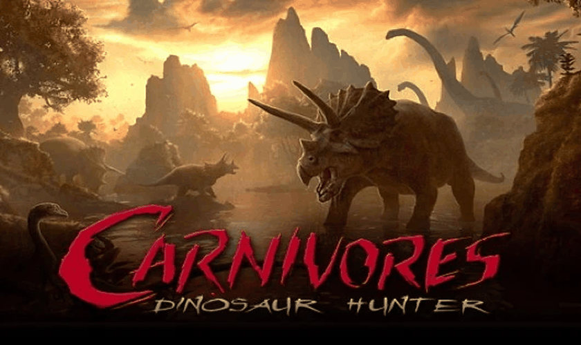

# Carnivores: Dinosaur Hunter — PS Vita port

<p align="center">
  
</p>

so-loader port of the Android version (1.3.1) of *Carnivores: Dinosaur Hunter* (Tatem Games / Action Forms).
It runs the original `libdinHunter.so` + `libfmodex.so` with an emulated Java layer (FalsoJNI).
You need your own copy of the game APK; nothing from the game is distributed here.

> Status: menus and hunting (3D maps) run on real hardware. See [`RELEASE.md`](RELEASE.md) and
> `port_progress.md`.

## Install

1. Install `kubridge.skprx` and `libshacccg.suprx` (ShaRKBR33D).
2. Install `carnivoresdinosaurhunter.vpk`.
3. Create `ux0:data/carnivoresdinosaurhunter/` and copy into it:
   - the original APK, named `CarnivoresDinosaurHunter.apk` (`main.apk` or `game.apk` also work)
   - `libdinHunter.so` and `libfmodex.so` from the APK's `lib/armeabi/` folder
4. Launch. The first boot loads for about 30 seconds on a static screen (on Android a splash
   screen covers it). Logs go to `ux0:data/carnivoresdinosaurhunter/logs/`.

Content packs (optional): on Android they are separate apps. Copy their APKs to the same folder:
- `CarnivoresBundleOne.apk` (`com.tatem.dinhunter.bundle.one`, areas 3-4 + sniper rifle) as `bundle1.apk`
- `CarnivoresBundleTwo.apk` (`com.tatem.dinhunter.bundle.two`, area 6 + double-barrel shotgun +
  crossbow) as `bundle2.apk`

A pack is unlocked only when its APK is present; without it, its maps and weapons stay locked.

## Controls

### Default controls

| Vita | Action |
|---|---|
| Touch screen | Original touch controls |
| Left stick | Move |
| Right stick | Look / aim |
| R | Fire (draws the weapon first if it is holstered) / take photo |
| Cross | Jump |
| Square | Draw / holster weapon |
| Triangle | Next weapon |
| L | Binoculars |
| Circle / D-pad up | Call dinosaurs |
| Select / D-pad down | Map |
| D-pad left | Weapon list (the HUD weapon button) |
| D-pad right | Photo mode zoom in |
| Start | Pause / back |
| **Start + Select** | **PS Vita controls & camera menu** |

Fire works with every "firing method" of the game's options (fire button, alternative fire button
or tap the screen).

### Menus

The game's menus can be used with buttons too: the d-pad or left stick moves a highlight over the
buttons, Cross presses the highlighted one, Left/Right move sliders and Circle (or Start) goes back.
Touching the screen hides the highlight; the next d-pad press brings it back.

### PS Vita controls & camera menu

Press **Start + Select** while hunting (the hunt is paused underneath), or **Select** in any of the
game's menus. From there:

- Remap every action: Cross replaces the buttons of the highlighted action, Square adds one more,
  Triangle leaves it unbound. A button can only belong to one action, so it is taken off the
  previous one. Rear touch quadrants count as buttons.
- Camera: right stick speed, invert up/down, invert left/right, swap sticks (left = camera).
- Opacity of the touch HUD buttons.
- Restore defaults.

Circle saves and closes. Bindings go to `ux0:data/carnivoresdinosaurhunter/controls.txt`, the rest to
`config.txt`; both can also be edited by hand:

```ini
VERSION = 2
FIRE = R1
JUMP = CROSS
WEAPON = SQUARE
NEXT_WEAPON = TRIANGLE
WEAPON_MENU = LEFT
BINOCULARS = L1
CALL = CIRCLE, UP
MAP = DOWN, SELECT
ZOOM_IN = RIGHT
ZOOM_OUT = NONE
```

Buttons: `CROSS`, `CIRCLE`, `SQUARE`, `TRIANGLE`, `L1`, `R1`, `UP`, `DOWN`, `LEFT`, `RIGHT`, `SELECT`,
rear touch `L2` (top-left), `R2` (top-right), `L3` (bottom-left), `R3` (bottom-right), and `NONE`.
`BUTTON = ACTION` lines work too. A `controls.txt` from an older version (without `VERSION = 2`) is
replaced by the defaults.

While hunting, the touch HUD buttons (move stick, fire, alternative fire, weapon, binoculars, call,
map, pause and the photo mode buttons) are drawn at 1% opacity, since the physical controls replace
them. They still respond to touch where they normally are. The compass and the menus keep their
normal look.

## Trophies (PS Vita System Integration)

The port integrates native PS Vita system trophies via `sceNpTrophy`.
When achievements are earned in-game, the official PlayStation Vita trophy notification pops up with the system sound and records progress into the console's Trophies application.
- Requires the `NoTrpDrm` plugin by Rinnegatamante to enable homebrew trophy support.
- If `NoTrpDrm` or a trophy pack is not installed, the game gracefully falls back and continues running without issues.

## Offline Optimizations & UI Cleanup

All network and Facebook sharing elements ("Share statistics to Facebook", "Share trophy to Facebook", "Share hunt to Facebook", and Facebook login/logout buttons) have been completely removed and disabled from menus, trophy rooms, and score screens. Functions related to social feeds and network posting are safely no-oped, keeping the interface clean and preventing zombie stalls.

## Options

`ux0:data/carnivoresdinosaurhunter/config.txt` (rewritten on every boot, so new keys show up):

| Key | Default | Meaning |
|---|---|---|
| `look_sensitivity` | `100` | Right stick camera speed in percent (10–400). Frame-rate independent; stacks with the in-game sensitivity slider |
| `invert_look_y` | `0` | Invert the camera's vertical axis |
| `invert_look_x` | `0` | Invert the camera's horizontal axis |
| `swap_sticks` | `0` | 1: left stick looks, right stick moves |
| `msaa` | `0` | Anti-aliasing: 0 off (fastest), 1 2x, 2 4x |
| `engine_log` | `0` | Write the game's own debug messages to the log (slow: several lines per asset while loading) |
| `hud_opacity` | `1` | Opacity of the touch HUD buttons while hunting, in percent (0–100; 100 = original). The compass is not affected |
| `vfp_float` | `1` | Run the game's software floating point on the Vita FPU (big speedup; 0 only to rule it out if something looks wrong) |

## Building

Requires VitaSDK. vitaGL is vendored in `vendor/vitaGL` and built automatically with
`SOFTFP_ABI=1 NO_SPLASHSCREEN=1 NO_DEBUG=1 HAVE_SHADER_CACHE=1`. Build and deploy with
psvita-port-toolkit (`psvita-toolkit build`, `psvita-toolkit deploy --vpk`), or plain CMake:

```sh
mkdir -p build && cd build && cmake .. -DCMAKE_POLICY_VERSION_MINIMUM=3.5 && make
```

The default build type is Release (the log only keeps errors). Configure with
`-DCMAKE_BUILD_TYPE=Debug` (`psvita-toolkit build --preset debug`) to get the full log back: in
Debug the game's own messages are always logged (whatever `engine_log` says), and every libzip
`zip_open()` is logged with its error code.

Two vitaGL gotchas this port depends on:

- The prebuilt `libvitaGL.a` from VitaSDK is not built with `SOFTFP_ABI=1`, and this loader is
  softfp: with it the game runs at 60 FPS on a permanently black screen.
- Do **not** enable `DRAW_SPEEDHACK` (1 or 2): it hands the large terrain vertex arrays straight
  from game memory to the GPU and the console GPU-crashes as soon as a hunt starts.

And one engine gotcha: the game's built-in libzip was compiled for Android and reads a bionic
`FILE` field to check `ferror()`, but here every `FILE*` comes from SceLibc. `source/patch.c`
patches those five checks. Without that patch the APK stops opening once a saved game exists
(the engine never closes its save file), which gives a black screen, and the content packs never
open.

## Credits

Based on [soloader-boilerplate](https://github.com/v-atamanenko/soloader-boilerplate) (TheFloW, Rinnegatamante,
Volodymyr Atamanenko) and FalsoJNI. vitaGL by Rinnegatamante, kubridge by bythos.
Input mapping, soft-float VFP hooks and vitaGL setup shared with the Carnivores: Ice Age Vita port
(same Tatem engine).

## License

The loader is MIT-licensed (see [LICENSE](LICENSE)). The game, its assets and its `.so` files remain
the property of Tatem Games.
